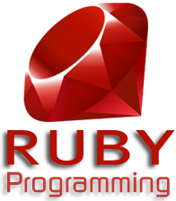

#  Ruby 中文版

Ruby 是一种开源的面向对象程序设计的服务器端脚本语言，在 20 世纪 90 年代中期由日本的松本行弘设计并开发。Ruby 可运行于多种平台，如 Windows、MAC OS 和 UNIX 的各种版本。


|更新日期    |更新内容
|----------|--------------------
|2015-04-22|Ruby 中文版

## 语言特点
- 完全面向对象:在Ruby语言中，任何东西都是对象，包括其他语言中的基本数据类型，比如整数
- 变量没有类型:Ruby的变量可以保存任何类型的数据。
- 任何东西都有值:不管是数学或者逻辑表达式还是一个语句，都会有值。
- ruby语言很优雅，可以做到不需要注释就可以读懂。

### 优点

- 语法简单
- 普通的面向对象功能(类,方法调用等)
- 特殊的面向对象功能(Mixin,特殊方法等)
- 操作符重载
- 错误处理功能
- 迭代器和闭包
- 垃圾回收
- 动态载入(取决于系统架构)
- 可移植性高.不仅可以运行在多数UNIX上,还可以运行在DOS,Windows,Mac,BeOS等平台上
- 适合于快速开发，一般开发效率是JAVA的5倍




学习本教程，您将对 Ruby 有一个全面的了解。

**[现在开始学习 Ruby！](ruby-intro.md)**


## 谁适合阅读本教程？

本教程有助于初学者理解 Ruby 语言基础知识及基本概念。

## 阅读本教程前，您需要了解的知识：

在您开始练习本教程中提供的各种实例之前，最好已经对计算机程序和计算机程序设计语言有一个基本的认识，这将有助于您对本教程的学习。

## 编译/执行 Ruby 程序

对于大多数编程语言，第一个入门实例便是 "Hello World!"，下面的实例使用 Ruby 输出 "Hello World!"：

```
    <pre> #!/usr/bin/ruby puts "Hello World!"; </pre>
```